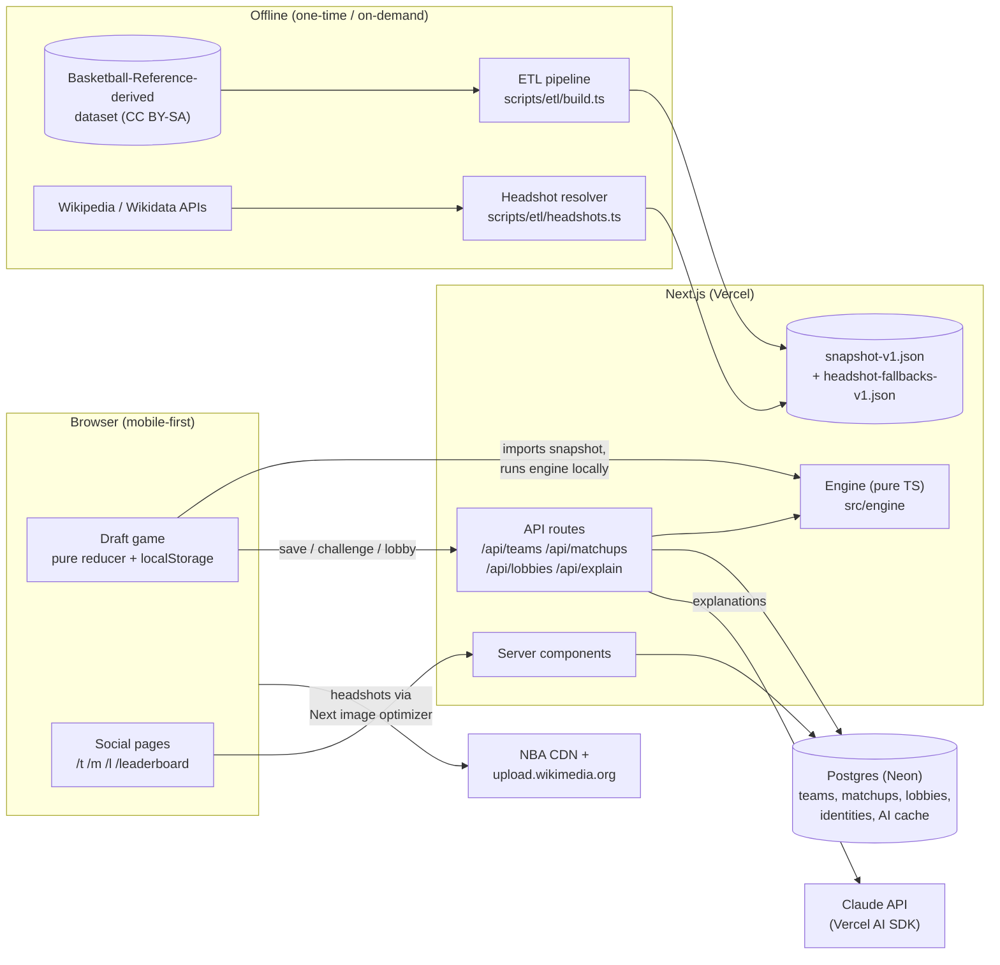
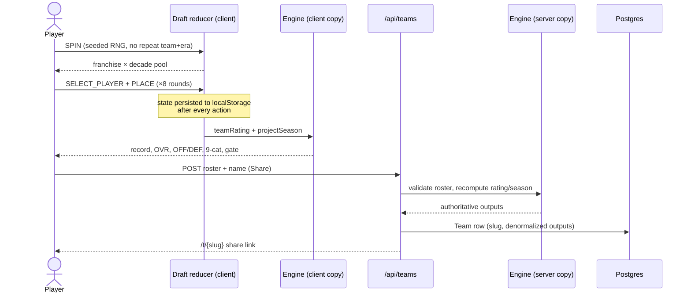
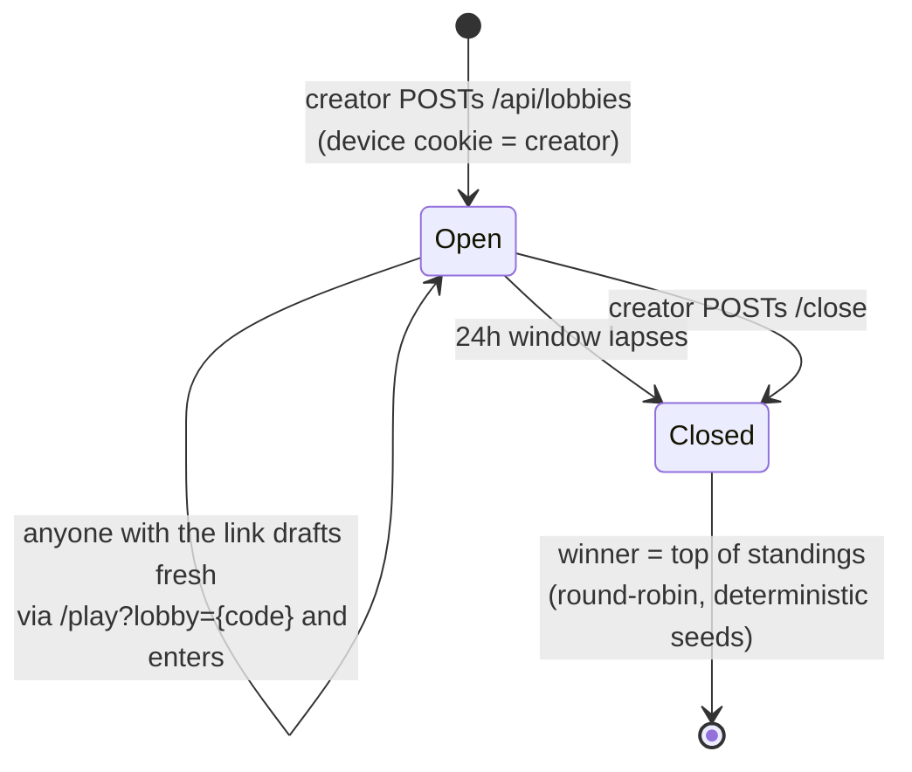
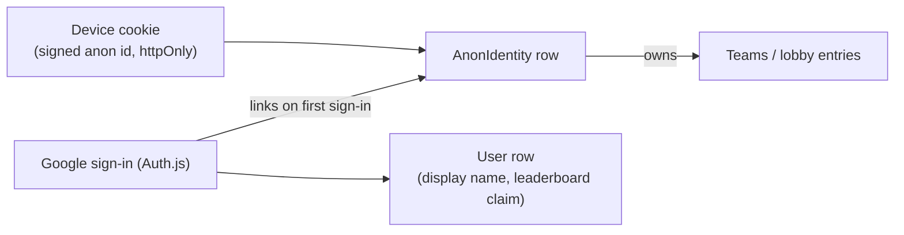
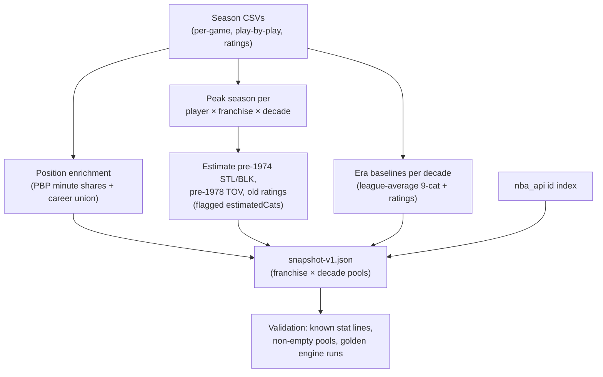

# 82-0 Plus — System Design

How the pieces fit together and how data flows through them. See
[technical-overview.md](./technical-overview.md) for what each component does
internally and [scaling.md](./scaling.md) for the productionization path.

## High-level architecture

Three trust zones:

1. **Offline ETL** produces a versioned, static snapshot. Nothing at runtime
   touches the source dataset or scrapes anything.
2. **The client** owns the draft experience end-to-end (spin, pick, simulate)
   against its bundled snapshot copy — zero network needed to play.
3. **The server is authoritative for anything persisted or competitive.**
   Every API route re-runs the engine on the submitted roster; client-computed
   numbers are never stored.

## Core game flow (draft → sim → save)

The same save call branches at the end for the two competitive modes:

- **Challenge** (`/play?challenge={slug}`): after saving, the client posts
  `/api/matchups`; the server simulates a deterministic best-of-7 between the
  two saved teams (seed = stable hash of the slugs) and the client lands on
  `/m/{id}`.
- **Lobby** (`/play?lobby={code}`): after saving, the client posts
  `/api/lobbies/enter`; the server enforces lobby rules (below) and the client
  lands on the standings.

## Lobby lifecycle

Entry rules enforced server-side in `/api/lobbies/enter`:
team must belong to the calling device's anonymous identity, must have been
created *after* the lobby opened (no loading saved teams), and the DB unique
constraint `(lobbyCode, anonIdentityId)` allows one entry per device.

## Identity model

Anonymous-first: every device gets a signed identity cookie on its first
write; sign-in is optional and retroactively claims the device's teams.

## Data pipeline

Headshots resolve separately (NBA CDN content-hash check → Wikipedia page
thumbnails → Wikidata P18 Commons images → silhouette), emitting
`headshot-fallbacks-v1.json`. The UI chains sources and never assumes an
image loads.
